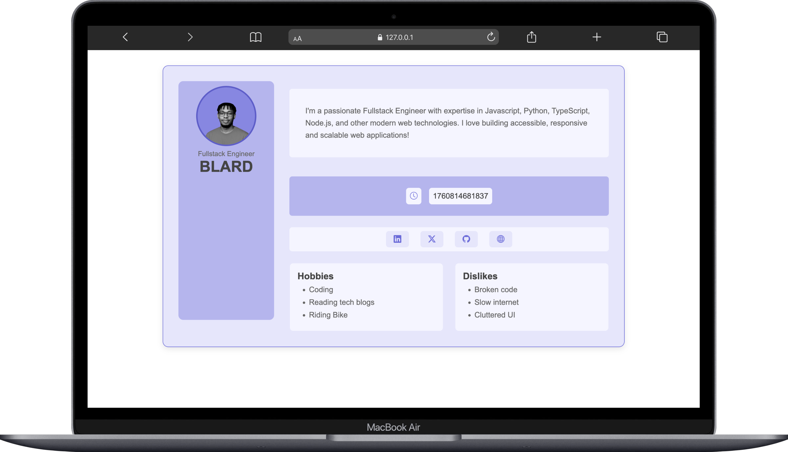

# Profile Card

A **responsive**, **accessible** Profile Card built with **HTML**, **CSS**, and **vanilla JavaScript** for the **HNG13 Stage 0 Frontend Task**.
This project demonstrates semantic structure, responsive design, accessibility best practices, and basic dynamic content handling.

---

## Features

* **Semantic HTML** using `<article>`, `<figure>`, `<nav>`, and `<section>`
* **Modern, responsive layout** — vertical on mobile, avatar-left/content-right on desktop
* **Dynamic current time** displayed in milliseconds via `Date.now()`
* **Accessibility**: alt text for avatar and keyboard-focusable social links
* **Testable elements** with required `data-testid` attributes
* **Clean UI** with Google Fonts, subtle animations, and truncation for long text
* **Structured content sections** for hobbies/dislikes (columns on desktop, stacked on mobile)

---

## Live Demo

[https://blard-omu.github.io/hng13-stage-0-frontend](https://blard-omu.github.io/hng13-stage-0-frontend)


---



---

## Getting Started

### Prerequisites

* A modern web browser (e.g., Chrome, Firefox)
* Git (for cloning the repo)
* A static file server *(optional for local testing)*

### Installation

```bash
# Clone this repository
git clone https://github.com/Blard-omu/hng13-stage-0-frontend.git

# Navigate into the project folder
cd hng13-stage-0-frontend
```

1. Update `index.html` with your details (name, bio, social links, avatar URL).
2. Open `index.html` in your browser **or** serve locally (e.g., with Live Server).
3. Access at:

   ```
   http://127.0.0.1:5500/index.html
   ```

---

## Usage

* Open the **live demo** or local URL in your browser.
* Navigate using mouse or **Tab key** for keyboard accessibility.
* Inspect `data-testid` attributes in DevTools (e.g., `test-profile-card`, `test-user-name`).
* Verify `test-user-time` matches `Date.now()` in milliseconds.
* Test responsiveness on mobile, tablet, and desktop views.

---

## Project Structure

```bash
hng13-stage-0-frontend/
├── index.html   # Semantic HTML structure
├── style.css    # Responsive CSS with Grid and animations
├── script.js    # JavaScript for dynamic time
└── README.md    # Project documentation
```

---

## Deployment

### Netlify

1. Create a [Netlify](https://www.netlify.com/) account and a new site.
2. Connect your GitHub repo (`Blard-omu/hng13-stage-0-frontend`).
3. Set the **build directory** to `.` (root).
4. Deploy and access at:

   ```
   https://your-site-name.netlify.app
   ```

### GitHub Pages

1. Push your code to GitHub.
2. Go to **Settings > Pages**.
3. Set the source to `main` branch, root folder.
4. Access at:

   ```
   https://Blard-omu.github.io/hng13-stage-0-frontend
   ```

---

## Testing

### Manual Testing

* Verify required elements exist (`test-profile-card`, `test-user-name`, etc.) using DevTools.
* Check `test-user-time` matches `Date.now()` (within a small delta).
* Test responsiveness by resizing the browser or using DevTools mobile view.
* Use **Tab** navigation to ensure all links are focusable and accessible.
* Confirm bio truncates gracefully for long text.

### Automated Testing (Example with Cypress)

```javascript
describe('Profile Card', () => {
  it('has all required elements', () => {
    cy.visit('http://127.0.0.1:5500/index.html');
    cy.get('[data-testid="test-profile-card"]').should('exist');
    cy.get('[data-testid="test-user-name"]').should('have.text', 'BLARD');
    cy.get('[data-testid="test-user-time"]').invoke('text').should('match', /^\d+$/);
  });
});
```

---

## Technologies Used

* **HTML5** — semantic structure
* **CSS3** — Grid, media queries, Google Fonts, animations
* **Vanilla JavaScript** — dynamic time rendering

---

## Author

**Name:** BLARD Omu
**Email:** [peteromu76@gmail.com](mailto:peteromu76@gmail.com)

---

## License

This project is licensed under the **ISC License**.

---

✅ *Built for HNG13 Stage 0 — accessible, responsive, and testable UI design.*
